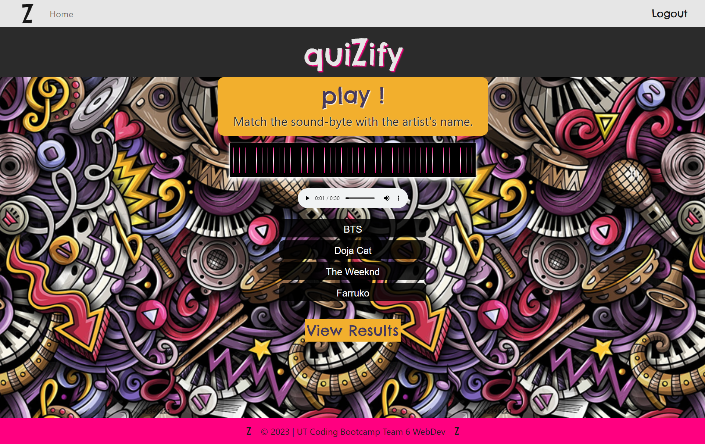

# quiZify

 
 

## Description
This application turns finding your new favorite song into an exciting and engaging game. Simply listen to a brief song clip and try to match it with the correct artist! At the end of the game, you can save your favorite tracks to a song queue in your user profile.

## Table of Contents

- [Installation](#installation)
- [Usage](#usage)
- [Technology Stack](#technology-stack)
- [Credits](#credits)
- [License](#license)
- [Contact](#contact)

## Installation

No installation required! Simply visit https://quizify.herokuapp.com to play quiZify.

Be sure to <i>Sign Up & Sign In</i> to experience the fun!

## Usage 

Does it seem a little dull in here to you? 
Homepage: 

I thought you said this was supposed to be fun. 
Oh, now wait a minute...

How about we play Match Song + Artist Name?
This is a BLAST!!

Now I can view the songs I heard during my game:

Oh phew! I forgot to write them down to listen again later. Thank goodness my Profile Page saves them for me:

## Technology Stack

|  | Tech Stack | Description |
| ---- | --- | --- |
| Foundation |  |  |
|  | JavaScript | Scripting language for webpages |
|  | MySQL | Open Source SQL database management system |
|  | Handlebars | JS library for creating reusable HTML website templates |
|  | Node.js | Javascript Framework |
| npm Packages |  |  |
|  | Sequelize | TypeScript and Node.js ORM |
|  | Nodemon | Utility to monitor code changes and restart server |
|  | Dotenv | Secrets management toolkit |
|  | Express | Node.js module |
|  | Howler.js | JS audio library |
|  | Bcrypt Hash | Cryptographic hashing algorithm |
| Testing |  |  |

## License
This project is licensed under: [MIT](https://choosealicense.com/licenses/mit/)
 

## Credits/Contact

For questions, please contact:

### Sunny Ovson: 
  - GitHub: &nbsp;&nbsp; [SunnyOhK](https://github.com/SunnyOhK)
### Brad Hall: 
  - GitHub: &nbsp;&nbsp;&nbsp; [Bradfh](https://github.com/Bradfh)
### Ulises Garfias: 
  - GitHub: &nbsp;&nbsp; [garfias06](https://github.com/garfias06)
### Christian Asberry: 
  - GitHub: &nbsp;&nbsp; [Cristian01021](https://github.com/Cristian01021)
  